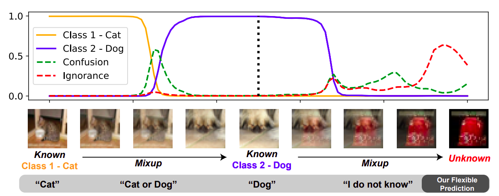
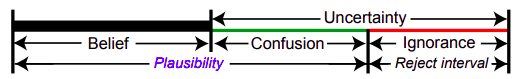
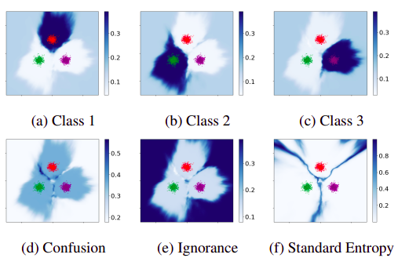
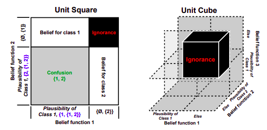
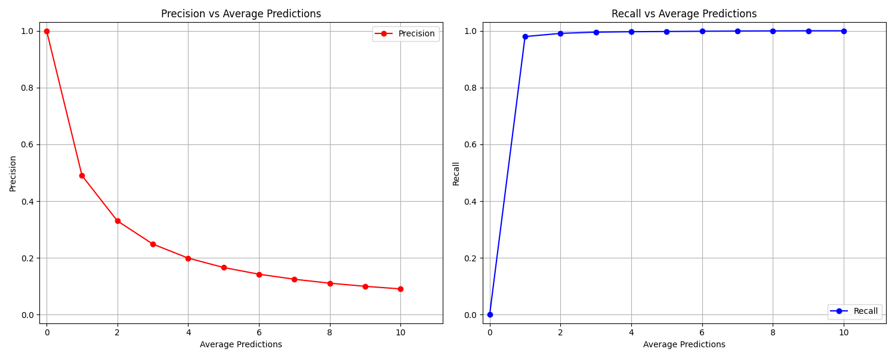
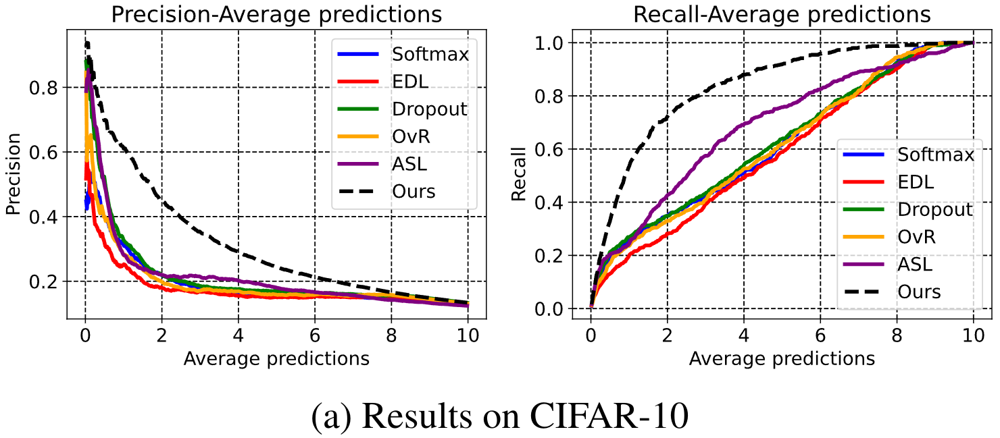
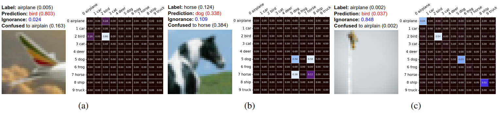
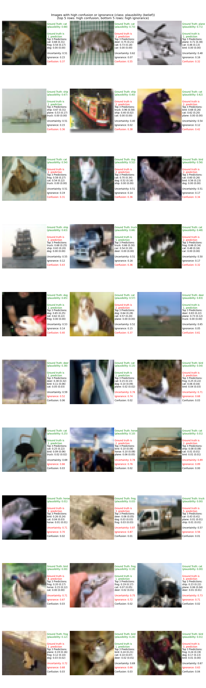
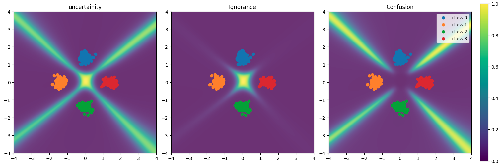

# [Flexible Visual Recognition by Evidential Modeling of Confusion and Ignorance](https://openaccess.thecvf.com/content/ICCV2023/papers/Fan_Flexible_Visual_Recognition_by_Evidential_Modeling_of_Confusion_and_Ignorance_ICCV_2023_paper.pdf)

This readme file is an outcome of the [CENG502 (Spring 2024)](https://ceng.metu.edu.tr/~skalkan/ADL/) project for reproducing a paper without any public implementation. See [CENG502 (Spring 2024) Project List](https://github.com/CENG502-Projects/CENG502-Spring2024) for a complete list of all paper reproduction projects.

# 1. Introduction

This project is a reproduction of the paper titled “Flexible Visual Recognition by Evidential Modeling of Confusion and Ignorance”, which was published in the International Conference on Computer Vision (ICCV) in 2023. The paper tackles the inherent difficulties in visual recognition systems, specifically the frequent errors in classifying known categories and the system’s tendency to incorrectly handle images that don’t belong to any of the classes it has been trained on. The goal of this project is to reproduce the results presented in the paper, specifically focusing on the experiments conducted on the CIFAR-10 and CIFAR-100 datasets, and verify the effectiveness of the proposed method.

## 1.1. Paper summary

The paper presents a novel method that enhances the capabilities of a visual recognition system by allowing it to explicitly express uncertainty and source trust. This is particularly important in real-world scenarios where the input can be unpredictable and varied, and the system needs to make decisions based on incomplete or ambiguous information.

The authors focus on two types of uncertainties: confusion and ignorance. Confusion refers to the uncertainty that arises when the system has difficulty distinguishing between different classes. Ignorance, on the other hand, refers to the uncertainty that arises when the system encounters unfamiliar or out-of-distribution data. These uncertainties are quantified using Subjective Logic.

The effect of these uncertainties can be seen in Figure 1, where the system detects <b>confusion</b> when there are multiple classification options with non-low probabilities <i>(conflicting evidence)</i>, and <b>ignorance</b> when all class probabilities is low to make a decision <i>(absence of evidence)</i>.

<p align="center">
  
  <br>
  <em>Figure 1: Classification, confusion and ignorance values for<br> Known->Confusion->Known->Ignorance image transformation with Mixup <br>for illustrative purposes <i>(from the paper)</i>.</em>
</p>

To handle these uncertainties, the authors propose predicting Dirichlet concentration parameters for singletons, which they refer to as “subjective opinions”. These subjective opinions enable the system to make more flexible decisions, enhancing its adaptability and performance in visual recognition tasks. For instance, if the system is unsure about a particular classification (the decision is in the <i>reject interval</i> as it can be seen in the Figure 2), it can express this uncertainty and potentially defer the decision to a human operator or request additional information.

<p align="center">
  
  <br>
  <em>Figure 2: Belief, confusion and ignorance as intervals. <i>(from the paper)</i>.</em>
</p>

The effectiveness of the proposed method is demonstrated through a series of experiments. In synthetic data analysis, the method is shown to effectively separate confusion and ignorance, providing a clear indication of the source of uncertainty, which can be observed in Figure 3. In visual recognition tasks, the method improves the system’s ability to correctly classify images, even in the presence of confusion and ignorance. In open-set detection tasks, the method effectively identifies out-of-distribution data, demonstrating its robustness and adaptability.


<p align="center">
  
  <br>
  <em>Figure 3: Synthetic data experiment results <i>(from the paper)</i>.</em>
</p>

The authors also compare their method with existing approaches and show that it outperforms them in various aspects. They argue that traditional methods, such as softmax, may not be suitable for deriving confusion from probability after training, and that the proposed method provides a more effective solution.

In conclusion, the paper introduces a unique approach to handling uncertainties in visual recognition systems, providing a significant contribution to the field. The proposed method not only improves the performance of the system but also enhances its adaptability and robustness by enabling more informed and dynamic decision-making, which provides a more suitable and flexible approach in terms of real-world applications.

# 2. The method and my interpretation

## 2.1. The original method

The original method proposed in the paper is a novel approach to handle uncertainties in visual recognition systems using the theory of Subjective Logic. This theory allows the system to express uncertainty and source trust explicitly, which is crucial in real-world scenarios where the input can be unpredictable and varied.

In the paper, it is modeled that the uncertainty $U$ for each sample $x$ comes from two seperate sources, i.e., confusion $C$ and ignorance $I$. This is represented as:

$$U^x = C^x + I^x$$

We define the $2^\Theta$ as the power set of the set of classes $\Theta$:

$$2^{\Theta} = \{A | A \subseteq \Theta\}$$

Also, we say $b_A$ is the belief assignment of the proposition $A$. If we sum up all $b_A$ for all propositions $A$, we get the equation below:

$$\sum_{A \in 2^{\Theta}} b_A = 1$$

The belief for any proposition is then calculated as the summation of contained mass:

$$b_A = \sum_{B, B \subseteq A} b_B$$


And also, we have the uncertainty $U$ as:

$$U = 1 - \sum_{i=1}^{K} b_i$$

Now, if we substitute the modeled uncertainty $U$ into this equation, we obtain:

$$C + I = 1 - \sum_{i=1}^{K} b_i$$
$$C + I + \sum_{i=1}^{K} b_i = 1$$


<br>
<br>
These uncertainties in the method (confusion and ignorance) are explained and formulated as below:

1. **Confusion**:

This type of uncertainty arises when the system finds it challenging to make a clear distinction between known classes. For instance, an image might contain features that match multiple known classes, making it difficult for the system to confidently assign it to one specific class. The overall confusion $C$ is the total mass of the non-singleton subsets. In other words, the confusion $C$ is the sum of masses shared between two or more classes. This is represented as:

$$C = \sum_{A, A \in 2^{\Theta}, 2 \leq |A| \leq K} b_A$$


Additionally, we can seperate the confusion as class-related confusion and class-unrelated confusion. They are defined for class $i$ as:

$$C_{i} = \sum_{A, A \in 2^{\Theta}, 2 \leq |A| \leq K, i \bigcap A = i} b_A$$

$$C_{\neg i} = \sum_{A, A \in 2^{\Theta}, 2 \leq |A| \leq K, i \bigcap A \neq i} b_A$$

where:

$$C =  C_i + C_{\neg i}$$


Now, we define the plausibility for class $i$, which is the total mass of propositions that has a non-empty union with the current one, as:

$$pl_i = b_i + C_i$$


In the Figure 2, you can see the relation between belief, class-related confusion and plausibility values, where plausibility ($pl$) is equal to belief ($b$) summed with the class-related confusion ($C_i$).


2. **Ignorance**:

This type of uncertainty comes into play when the system encounters an input that is entirely outside its training distribution. In such cases, the system lacks any relevant evidence to base a decision on, leading to high ignorance.

We define the plausiblity function (which will be crucial soon) for class $i$ as:

$$f_i(x) = (pl_i, 1 - pl_i)$$


For $K$ plausibility functions, the belief assignment of any proposition $A$ is combined by computing as:

$$b_A = \sum_{B, \cap B = A} \prod_{j=1}^{K} b_{B,j}(x) = \sum_{B, \cap B = A} \prod_{j=1}^{K} f_{j}^{B}(x)$$


So, we can further clarify the singleton belief of the class $i$ as:

$$b_i = pl_i \prod_{j=1, j \neq i}^{K} (1 - pl_j) = f_{i}^{1}(x) \prod_{j=1, j \neq i}^{K} f_{j}^{2}(x)$$

The ignorance $I$ could be calculated similarly as:

$$I = \prod_{j=1}^{K} (1 - pl_j) = \prod_{j=1}^{K} f_{j}^{2}(x)$$

The total confusion between all different class combinations is $C = U - I$.


Also, from the previous equations, we can derive:

$$C + I + \sum_{i=1}^{K} b_i = \sum_{A, A \in 2^{\Theta}, 2 \leq |A| \leq K} b_A + I + \sum_{i=1}^{K} b_i = 1$$

The ignorance I, therefore, could be regarded as
the mass placed on the empty set $\emptyset$ in the frame, which indicates the level of lacking evidence.


The demonstration of the combination process with 2 and 3 class exaples are in the Figure 4 below:

<p align="center">
  
  <br>
  <em>Figure 4: Evidence combination demonstration <i>(from the paper)</i>.</em>
</p>


To model these uncertainties, the method predicts Dirichlet concentration parameters for singletons. In the context of Subjective Logic, a singleton is a set with only one element. These predictions allow the system to form what the authors call “subjective opinions”.

A subjective opinion in this context is a type of probabilistic estimate that provides a probability for each possible outcome, along with an estimate of the uncertainty of these probabilities. This dual nature of subjective opinions allows the system to express nuanced views like “I think this image is probably of a cat, but I’m not very sure”.

By forming these subjective opinions, the system can make more flexible decisions. For example, if the system is very uncertain (high confusion), it can decide to predict multiple classes instead of just one. If the system doesn’t have any relevant evidence (high ignorance), it can decide to reject making a prediction altogether.

This approach allows the system to handle the complexities and uncertainties of real-world visual recognition tasks more effectively, enhancing its adaptability and performance. It’s a significant step forward in the field of visual recognition, paving the way for more robust and flexible systems.

In terms of methodology, the paper uses the theory of Subjective Logic to model the uncertainties. The recognition process is regarded as an evidence-collecting process where confusion is defined as conflicting evidence, while ignorance is the absence of evidence. By predicting Dirichlet concentration parameters for singletons, comprehensive subjective opinions, including confusion and ignorance, could be achieved via further evidence combinations.

The paper proposes to decompose the problem into $K$ plausibility functions $f_i(\cdot)$ for $i = 1, . . . , K$ on the same frame. Each plausibility function $f_i(\cdot)$ is designed to give two predictions only considering class $i$, which is written as $f_i(x) = (pl_i, 1 - pl_i)$. The computational complexity is $O(n)$ and we could only calculate necessary confusion terms for specific conditions.


In this paper, each plausibility function $f_{i}(·)$ is decided to be a single multi-output layer after being activated by a sigmoid function $\sigma(·)$. The output is regarded as the value of class plausibility. The plausibility function is then formulated as: 

$$(pl_{i},1-pl_{i})=f_{i}(x)=\sigma(w_{i}^{T}\Phi(x))$$

where $\Phi(x)$ constructs a D-dimensional feature embedding from the input $x$, and $w_{i}$ is the weight vector for class $i$. 

The learning of singleton belief is implemented as evidence acquisition on a Dirichlet prior. The loss of EDL is: 

$$L_{EDL}=\sum_{i=1}^{K}y_{i}[log(\sum_{j=1}^{K}α_{j})-log(α_{i})]$$

For the class $x$, the label i one-hot vector $y = [y_{1}, y_{2}, . . . , y_{i}, . . . , y_{K}]^{T}$ , and parameters of a Dirichlet distribution $Dir(·|α)$ are $α = [α_{1}, α_{2}, . . . α_{K}]^{T}$.


$α$ is calculated directly from singleton beliefs and overall uncertainty, different from EDL. It is obtained as:

$$α_{i}=KU_{b_{i}}+1=\dfrac{1-\sum_{j=1}^{K}{b_{j}}}{K}Kb_{i}+1$$

During inference, $b_{i}$ could be obtained from output of plausibility functions using the formula of singleton belief of a class.

For a better plausibility function, a regularization term is added: 

$$L_{reg}=\sum_{i=1}^{K}y_{i}[pl_{i}-(1-\hat{I})]^{2}$$

where $\hat{I}$ is the current estimation of ignorance.

Following EDL, KL loss is used to minimize the unrelated class evidence: 

$$L_{KL}=KL(Dir(·|α~)||Dir(·|⟨1,…,1⟩))$$

where $α~=y+(1−y)⊙α$, $⊙$ for element-wise multiplication.

The final loss is: 

$$L=L_{EDL}+λ_{reg}L_{reg}+λ_{KL}L_{KL}$$

We use weights to balance the losses. We gradually increase the effect of $L_{KL}$ through an additional annealing coefficient.


## 2.2. Our interpretation 

- !!! When we tried to trained the models from scratch, the KL loss and REG loss were started and remained as 0, causing the model to learn nothing. We investigated the reason and concluded that it is due to the very low initial outputs of the model. Since all outputs are very low and similar in the beginning, the confusion results are computed very close (or equal to) 1, which prevents the model to improve. <br> To solve this issue, we developed a method where we initially train a model with cross-entropy loss for a few epochs to get the model to have some somehow not bad initial guesses. This allowed the model to learn and improve, which yielded the results we optained. However, we don't know what exactly the authors did to overcome this issue.

- They stated that they gradually increase the effect of the KL loss term by increasing the <b>effect</b> of its coefficient by stating "Each loss term is accompanied by a balance weight, and we gradually increase the effect of KL loss through an additional annealing coefficient." rigth after eq 13 in the paper. <br> But later, they mentioned it anneals to 0. But since it is more detailed (containing the numbers), we decided to start Lambda KL as 0.05 and linearly decreased it to 0 as we approached to the last epoch. This part is mentioned in the paper as: "Specifically,
we set the learning rate for both methods to 0.004 with a momentum of 0.9 for the batch size of 128. λKL in Eq. 13 anneals to 0 with epochs with the maximum coefficient of 0.05, and λreg is set to 1." in the implementation details part of the paper.

- Also, they did not declare the optimized they use (SGD, Adam, etc.) in the paper. So, we decided to use SGD with the stated larning rate and momentum. We also added a weight decay and used cosine annealing learning rate scheduler.


- They did not explicitly mention how they calculate the KL loss in the paper. So, we decided to follow the cited EDL paper's code in the original paper as they stated they followed it too.


- For the results plots in the Figure 5 of the paper, the curves are too noisy (almost like hand drawn). We could not clearly interpret the "Average predictions" term, and used the values from 0 to number of classes since it aligned with the plot.


- For the toy 2-D dataset experiments, they did not specify any details for training. Also, picking the distance=9 and std=4 for constructing the dataset resulted a different dataset than the one in the paper. So, we decided to use a smaller std for the toy experiments. Also, the MLP structure that we used yielded results with high plausibility even when the points are too far from the samples (except they are nearly equally distant to the data centers.)


- We also questioned the AUROC scored stated in the paper since they seemed too low to us. We tried both sklearn and torcheval libraries to calculate the AUROC scores but we always get much higher AUROC scores.


# 3. Experiments and results

## 3.1. Experimental setup

In the original paper, a variety of experiments were conducted to test the proposed method's effectiveness in handling uncertainties in visual recognition systems. The experiments were designed to demonstrate the separation of two sources of uncertainty, indicate the correct class on misclassified samples with estimated confusion, and apply ignorance to compare with other methods on the task open-set detection.

The authors used the ResNet-18 as the backbone for their experiments, except on synthetic data and open-set detection. The dimension of the extracted feature was set to 512. For the proposed method, they applied the sigmoid activation on the last linear layer to work as multiple plausibility functions. They found both EDL and their method to be more sensitive to the learning rate. Specifically, they set the learning rate for both methods to 0.004 with a momentum of 0.9 for the batch size of 128. The $\lambda_{KL}$ in Eq. 13 annealed to 0 with epochs with the maximum coefficient of 0.05, and $\lambda_{reg}$ was set to 1.

For our study, we have decided to focus specifically on the CIFAR-10 and CIFAR-100 datasets for the open-set detection task. These datasets are directly obtained from $\texttt{torchvision.datasets.CIFAR10}$ and $\texttt{torchvision.datasets.CIFAR100}$ respectively.

The CIFAR-10 dataset consists of 60,000 32x32 color images in 10 classes, with 6,000 images per class. There are 50,000 training images and 10,000 test images.

The CIFAR-100 dataset is just like the CIFAR-10, except it has 100 classes containing 600 images each. There are 500 training images and 100 testing images per class. The 100 classes in the CIFAR-100 are grouped into 20 coarse classes.

This focus will allow us to thoroughly investigate and understand the performance of the proposed method on these particular datasets. We have not made any changes to the original experimental setup and have followed the same procedures and settings as described in the paper to ensure the accuracy of our results. Our goal is to verify the effectiveness of the proposed method as presented in the original paper.

## 3.2. Running the code

### Project Setup

#### Setup Environment

1. **Create a new conda environment** named `custom_loss` with Python 3.9:
    ```bash
    conda create -n custom_loss python=3.9
    ```

2. **Activate** the newly created environment:
    ```bash
    conda activate custom_loss
    ```

3. **Install PyTorch** and related libraries with CUDA support:
    ```bash
    conda install pytorch torchvision torchaudio pytorch-cuda=11.8 -c pytorch -c nvidia
    ```

4. **Install additional required Python packages** from the `requirements.txt` file:
    ```bash
    pip install -r requirements.txt
    ```

5. **Download the necessary data**:
    ```bash
    bash download_data.sh
    ```

#### Usage

##### Train a model with CrossEntropyLoss on CIFAR10 dataset for 200 epochs
```bash
python main.py --loss CrossEntropyLoss --save_path ./results/CIFAR10/exp1/ --dataset CIFAR10 --max_num_epochs 200
```

##### Train a model with CustomLoss on CIFAR10 dataset for 200 epochs. 
```bash
python main.py --loss CustomLoss --save_path ./results/CIFAR10/exp2/ --model_path ./results/CIFAR10/exp1/checkpoint_1000.pth --dataset CIFAR10 --resume --max_num_epochs 200
```

##### Train a model with CrossEntropyLoss on CIFAR100 dataset for 200 epochs
```bash
python main.py --loss CrossEntropyLoss --save_path ./results/CIFAR100/exp1/ --dataset CIFAR100 --max_num_epochs 200
```

##### Train a model with CustomLoss on CIFAR100 dataset for 200 epochs
```bash
python main.py --loss CustomLoss --save_path ./results/CIFAR100/exp2/ --model_path ./results/CIFAR100/exp1/checkpoint_1000.pth --dataset CIFAR100 --resume --max_num_epochs 200
```

#### Pre-trained Models

The model trained on the CIFAR10 and CIFAR100 datasets for 200 epochs can be found in this [link](https://drive.google.com/drive/folders/1vjfo9FlwEuImDOGvFxDm_he1nAwZCKO2?usp=sharing).

## 3.3. Results

All of our results can be re-implemented with loading a pretrained model using the "results.ipynb" jupyter notebook. The results are in the notebook with precalculated values and plots.

For CIFAR-10, we have obtained a comparable test accuracy of 93.9% and an AUROC score of 99.63%, which is much higher that the AUROC stated in the paper's Table 1. We have used sklearn's auroc metric and could not figured out how the authors calculated it to get these amounts.

We calculated the Precision and Recall vs num of predictions plots for the CIFAR-10 dataset.

Our plots:

<p align="center">
  
  <br>
  <em>Our plots</i>.</em>
</p>

Papers plots (from Figure 5):

<p align="center">
  
  <br>
  <em>The original plots (from the paper's fig. 5)</i>.</em>
</p>

<br>

We also calculated some random samples and picked the ones with high confusion or high ignorance like the original paper (from Figure 7). The main purpose is to show the effectiveness of the method in handling uncertainties.


<p align="center">
  
  <br>
  <em>Qualitative results (from the paper fig. 7)</i>.</em>
</p>


Our comprehensive results showing 15 examples of high confusion and 15 examples of high ignorance are as follows:

<p align="center">
  
  <br>
  <em>Qualitative results from our training</i>.</em>
</p>


Also, the plots from our toy experiments training with 4 classes is below:

<p align="center">
  
  <br>
  <em>Our 2-D toy dataset experiment results for measuring uncertainity</i>.</em>
</p>

We deeply thought on why we could not achieved the ignorance on distant points, and decided that the MLP structure we used produces high plausibility values for the points that are too far from the data centers. Maybe, the authors used a different MLP.

# 4. Conclusion

To conclude, the paper titled "Flexible Visual Recognition by Evidential Modeling of Confusion and Ignorance" achieves classifying confused images in a seperate way, as well as providing "ignorance" information to detect out-of-distribution data. The method proposed in the paper is a novel approach to handle uncertainties in visual recognition systems using the theory of Subjective Logic. The method allows the system to express uncertainty and source trust explicitly, which is crucial in real-world scenarios where the input can be unpredictable and varied. 

Regarding our implementation, we could achieve comparable quantitative and qualitative results with the original paper in the CIFAR10 dataset. However, we question how model can learn initially with this loss setup when it produces very low and similar outputs.

To solve this issue, we tried a creative approach of pretraining the model with 5-20 epochs with cross-entropy loss, which allowed the model to learn and improve for CIFAR10 dataset. But in the CIFAR100 dataset, it is very hard to get a good initial guess for 100 classes even with a small amount of pretraining.

However, the interpretation of dividing the uncertainty into confusion and ignorance and the method to handle these uncertainties are very exiciting and promising. As it can be seen in the results, when the confusion is high, model can made to predict multiple classes. And when the ignorance is high, we sometimes can't even trust the 2. highest plausibility class, which may be a good sign to reject any prediction in case of out-of-distribution data is possible.

# 5. References

- Fan, L., Liu, B., Li, H., Wu, Y., & Hua, G. (2023, September 14). Flexible visual recognition by evidential modeling of confusion and ignorance. arXiv.org. https://arxiv.org/abs/2309.07403

- Subjective logic. (n.d.). springerprofessional.de. https://www.springerprofessional.de/en/subjective-logic/10991958

- Sensoy, M., Kaplan, L., & Kandemir, M. (2018, June 5). Evidential deep learning to quantify classification uncertainty. arXiv.org. https://arxiv.org/abs/1806.01768

- Krizhevsky, A. (2009). Learning Multiple Layers of Features from Tiny Images. https://www.semanticscholar.org/paper/Learning-Multiple-Layers-of-Features-from-Tiny-Krizhevsky/5d90f06bb70a0a3dced62413346235c02b1aa086

- Amini, A., Schwarting, W., Soleimany, A., & Rus, D. (2019, October 7). Deep evidential regression. arXiv.org. https://arxiv.org/abs/1910.02600

- Bao, W., Yu, Q., & Kong, Y. (2021, July 21). Evidential Deep learning for open set action recognition. arXiv.org. https://arxiv.org/abs/2107.10161

- Corbière, C., Lafon, M., Thome, N., Cord, M., & Pérez, P. (2021, September 23). Beyond First-Order Uncertainty Estimation with Evidential Models for Open-World Recognition. https://cnam.hal.science/hal-03347628/

- Barnett, J. A. (2008). Computational methods for a mathematical theory of evidence. In Springer eBooks (pp. 197–216). https://doi.org/10.1007/978-3-540-44792-4_8


# Contact

* Furkan Genç, genc.furkan@metu.edu.tr 
* Umut Özyurt, umut.ozyurt@metu.edu.tr

